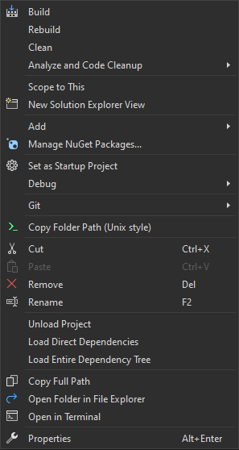

# A Visual Studio extension to copy project path in Unix/Linux style in Visual Studio's solution explorer
A very simple extension for Visual Studio made out of frustration over a narrow case:

For simpler usage of .NET CLI in a Git Bash inside Windows Terminal on Windows, I need to `cd` to the project's directory to build, run, etc. The context menu in the Visual Studio's solution explorer gives me the full path to the project in DOS/Windows format i.e. with backslashes as the path delimiter, while Git Bash needs the Unix/Linux style i.e. with forward-slashes. To convert the backslashes to forward-slahses in the path you could use something like below (or an external tool):

```console
$ p='\a\b\c'
$ echo "${p//\\//}"
```

But it's an extra step and why not using fewer clicks and keystrokes? By using this extension you can get the path to the project directory copied to your clipboard so that in Git Bash you can just `cd ctrl+v`. After installing this extension you will get a new option in the context menu when you right click on a project in the solution explorer as below:




